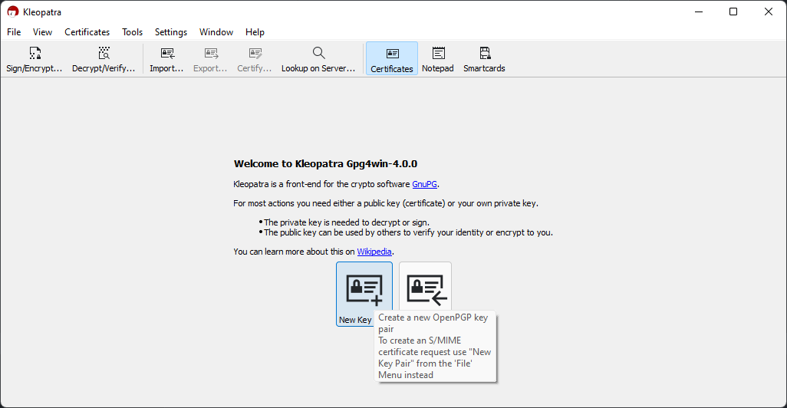

# Contributing

Thanks for taking the time to contribute! 😻

## Fix bugs by creating PR's

We appreciate every time you report a bug in the product. However, taking time to submit a PR can help us in fixing bugs quickly and ensure a healthy and stable eco-system.

Go through the following points, before creating a new PR.

1. Create an issue discussing the bug.
2. Once approved, go ahead and fork the REPO.
3. Make sure to start from the `main`, since this is the up-to-date branch.
4. Make sure to keep commits small and relevant.
5. Follow [our git commit message convention](#Git-Commit-Messages).
6. Once done with all the changes, create a PR against the `main` branch.

## Git Commit Messages

Example : ✨(infra): create a new orm interface

- Use this format `<gitmoji><type>(optional scope): <description>`\
  More examples [here](https://github.com/arvinxx/gitmoji-commit-workflow/tree/master/packages/commitlint-config)
- Limit the first line to 72 characters or less
- Consider starting the commit message with an applicable emoji:
  - ✨ - `:sparkles:` - Introduce new features.  
  - ⚡️ - `:zap:` - Improve performance.  
  - 🔥 - `:fire:` - Remove code or files.  
  - 🐛 - `:bug:` - Fix a bug.  
  - 📝 - `:memo:` - Add or update documentation.  
  - 💄 - `:lipstick:` - Add or update the UI and style files.  
  - 🚨 - `:rotating_light:` - Fix compiler / linter warnings.  
  - 💚 - `:green_heart:` - Fix CI Build.  
  - ⬇️ - `:arrow_down:` - Downgrade dependencies.  
  - ⬆️ - `:arrow_up:` - Upgrade dependencies.  
  - 👷 - `:construction_worker:` - Add or update CI build system.  
  - ♻️ - `:recycle:` - Refactor code.  
  - ✏️ - `:pencil2:` - Fix typos.  
  - 🧪 - `:test_tube:` - Add test(s).  

## How to set up your PGP key (**Linux**)

### Follow steps [here](https://docs.github.com/en/authentication/managing-commit-signature-verification/generating-a-new-gpg-key)

## How to set up your PGP key (**Windows**)

### Requirements

- [GPG4Win.exe](https://www.gpg4win.org/downloads/gpg4win.exe)
- GitHub Account

### Steps

#### 1. Run the **GPG4Win.exe** program

#### 2. Create a new key

#### 3. Add your name, email address and (optional) password

#### 4. In advanced settings, be sure to have RSA selected with a key size of 4096 bits

#### 5. Click **Ok** and **Create**

#### 6. Enter your password when prompted

#### 7. Double-click the key you just created

#### 8. Click **Export**

#### 9. Copy the key to your clipboard

#### 10. Paste the key into your [GitHub account](https://github.com/settings/keys)

Congratulations! You have successfully set up your PGP key. :)
