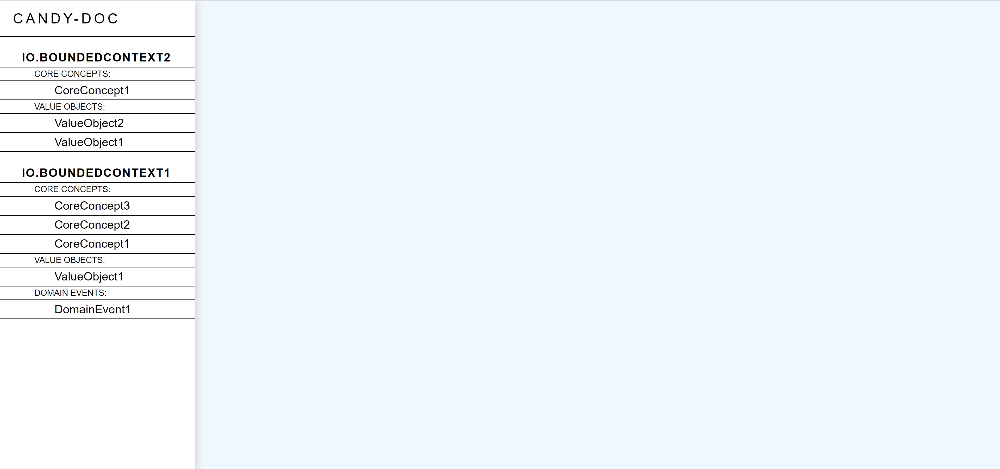
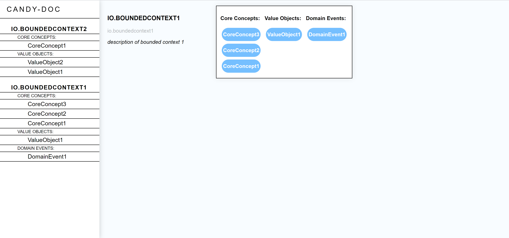
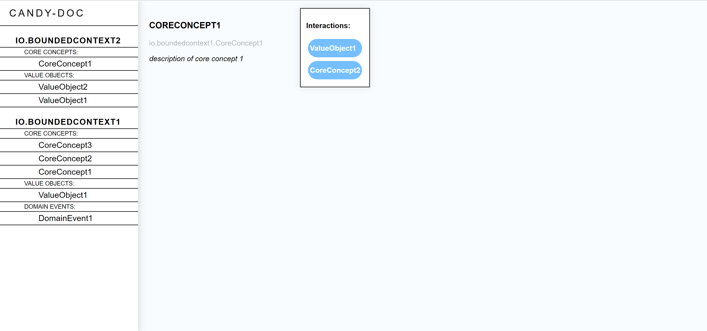
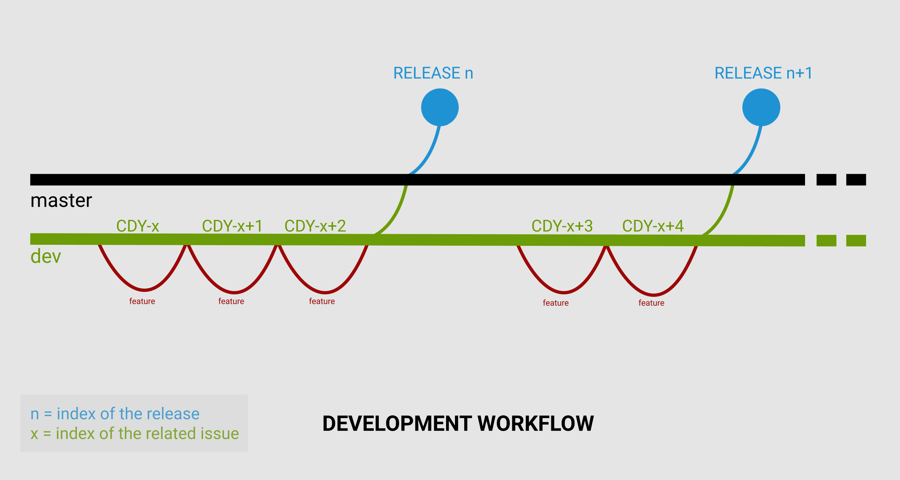

# CANDY-DOC
<!-- ALL-CONTRIBUTORS-BADGE:START - Do not remove or modify this section -->
[](#contributors-)
<!-- ALL-CONTRIBUTORS-BADGE:END -->

Candy-Doc is a documentation generator plugin for projects built with the Domain-Driven-Design approach.

> _"Domain-Driven Design is an approach to software development that centers the development on programming a domain model that has a rich understanding of the processes and rules of a domain."_ -  Martin Fowler 
> [See more](#References)

## Table of content

* [Installation](#Installation)
* [DDD Annotations](#DDD_Annotations)
  *  [Aggregate](#Aggregate)
  *  [Bounded Context](#Bounded_Context)
  *  [Core Concept](#Core_Concept)
  *  [Domain Command](#Domain_Command)
  *  [Domain Event](#Domain_Event)
  *  [Value Object](#Value_Object)
* [HTML Documentation](#HTML_Documentation)
* [[FOR DEVELOPERS ONLY] Development workflow](#Development_workflow)
* [Technologies](#Technologies)
* [References](#References)

<a name="Installation"></a>

## Installation

### With Maven

To run this plugin, import the following:

```xml
<dependency>
    <groupId>io.candy-doc</groupId>
    <artifactId>candy-doc</artifactId>
    <version>${candy-doc.version}</version>
</dependency>

<plugin>
    <groupId>io.candy-doc</groupId>
    <artifactId>candy-doc</artifactId>
    <version>${candy-doc.version}</version>
    <executions>
        <execution>
            <goals>
                <goal>candy-doc</goal>
            </goals>
        </execution>
    </executions>
    <configuration>
        <packagesToScan>
            <packagesToScan>com.foo.bar</packagesToScan>
        </packagesToScan>
        <outputFormat>html</outputFormat>
    </configuration>
</plugin>
```

Then, specify the configuration parameters:

**packagesToScan:** The chosen packages to scan to generate a documentation for.

Example:

```xml
<packagesToScan>     
    <packagesToScan>com.foo.bar.baz</packagesToScan>
    <packagesToScan>com.foo.qux</packagesToScan>
<packagesToScan>
```
**outputFormat:** The output format in which the documentation is generated. Output format can be either `html`, `yml`
or `json`.


Once your project is correctly annotated with the [DDD Annotations](#DDD_Annotations), use mvn to run the plugin (replace `${candy-doc.version}` with the current version you are using):

`mvn io.candy-doc:candy-doc:${candy-doc.version}:candy-doc`

The documentation will be generated in the `target/candy-doc` directory.

<a name="DDD_Annotations"></a>

## DDD Annotations

Domain-Driven-Design concepts are identified with annotations.

<a name="Aggregate"></a>

### Aggregate

```java
@Aggregate(name="", description="")
```

Cluster of domain objects that can be treated as a single unit. It has an identity and a lifetime. 

An aggregate contains the domain logic and is aware of framework issues.

It is accessed by commands, returns events and deals with value objects.

Value objects in an aggregate are usually seen as Domain entities.
This is the only domain model that can be mutable.

<a name="Bounded_Context"></a>

### Bounded Context

```java
@BoundedContext(name="", description="")
```

Set of elements (classes, services, etc) containing only what is needed in a specific context.

Only `package-info.java` files can be annotated with `@BoundedContext`. Every other concepts must be inside a bounded
context.

<a name="Core_Concept"></a>

### Core Concept

```java
@CoreConcept(name="", description="")
```

Concept with the highest level of importance inside a bounded context. It is used in the domain layer, on aggregates and value objects.

A Core Concept can interact with other concepts.

<a name="Domain_Command"></a>

### Domain Command

```java
@DomainCommand(description="")
```

A command is the entry point to perform a business logic from an aggregate.

It should use primitives only (and could use value objects) and is performed on an aggregate.

<a name="Domain_Event"></a>

### Domain Event

```java
@DomainEvent(description="")
```

Captures the memory of something interesting which affects the domain. It usually starts with a verb in the past tense.

An event should always stay dumb and only carry static information. 

Moreover, domain events cannot use strong domain concepts as domain logic should never be used outside the domain.

<a name="Value_Object"></a>

### Value Object

```java
@ValueObject(description="")
```

An object that has no identity, no lifetime and who is compared based on his values.

A Core Concept can interact with one or more value objects. A Value Object only has primitive fields, is immutable and
should be valid when instantiated.

<a name="HTML_Documentation"></a>

## HTML Documentation

If you have chosen `html` as output format, you can open the generated _index.html_ file from your file explorer to have
access to the documentation.

Navigate between the concepts of your project thanks to the left-side menu



Access the content of each concept



See the interactions between concepts



<a name="Development_workflow"></a>

## [FOR DEVELOPERS ONLY] Development workflow

### Release policy:

The development team works on a branch named _dev_.

Whenever a feature needs to be implemented, a new branch must be pulled from _dev_ and merged to this latter once the feature is ready.

Every time a new version is about to be released, a merge from _dev_ to _master_ will create a new tag and a new package in the package registry. 

Eventually, the new release can be manually created from the new tag.



Explanations:

>Before each new feature, run:
>```
>git checkout dev
>git pull
>```
>Create a new branch CDY-x for the feature
>```
>git checkout -b CDY-x
>```
>Once the feature is implemented, squash and merge CDY-x to dev
>
>Merge dev to master when you are done with all the features for your new version.
> 
>/!\ Don't forget to pull the updated pom.xml once the release job is done. /!\
>
> ```
> git pull
> ```
### SSH Access:

The _release_ job in the `.gitlab-ci.yml` file uses SSH to connect to the Gitlab project in order to create a new tag for the release. 

Therefore, you must check the following variables are correct before making any changes to the _master_ branch:

- `Settings > Repository > Deploy keys > ci-token` (must be the public ssh key with write permissions granted)
- `Settings > CI/CD > CI_TOKEN_PRIVATE_KEY` (must be the private ssh key)


<a name="Technologies"></a>

## Technologies

Project created with:

| Technology  | Version   |
| --- | --- |
| Java              | 11     |
| Maven             | 3.6.3  |
| Reflections8      | 0.11.5 |
| Lombok            | 1.8.12 |
| Jackson           | 2.8.6  |
| Apache Freemarker | 2.3.31 |
| Apache Commons-IO | 2.8.0  |
| Maven Release     | 3.0.0-M4 |

<a name="References"></a>

## References


- DDD, en vrai pour le développeur (Cyrille Martraire): https://www.youtube.com/watch?v=h3DLKrvp5V8
  
- DDD (Martin Fowler): https://martinfowler.com/tags/domain%20driven%20design.html
  
- Summary of a 4 days DDD Training (Thomas Ferro): https://thomasferro.medium.com/summary-of-a-four-days-ddd-training-74103a6d99a1

## Contributors ✨

Thanks goes to these wonderful people ([emoji key](https://allcontributors.org/docs/en/emoji-key)):

<!-- ALL-CONTRIBUTORS-LIST:START - Do not remove or modify this section -->
<!-- prettier-ignore-start -->
<!-- markdownlint-disable -->
<table>
  <tr>
    <td align="center"><a href="https://github.com/mderoullers"><br /><sub><b>Maxime Deroullers</b></sub></a><br /><a href="https://github.com/Candy-Doc/candy-doc-maven-plugin/pulls?q=is%3Apr+reviewed-by%3Amderoullers" title="Reviewed Pull Requests">👀</a></td>
    <td align="center"><a href="https://ctacquet.com"><br /><sub><b>Charles Tacquet</b></sub></a><br /><a href="https://github.com/Candy-Doc/candy-doc-maven-plugin/commits?author=ctacquet" title="Documentation">📖</a></td>
  </tr>
</table>

<!-- markdownlint-restore -->
<!-- prettier-ignore-end -->

<!-- ALL-CONTRIBUTORS-LIST:END -->

This project follows the [all-contributors](https://github.com/all-contributors/all-contributors) specification. Contributions of any kind welcome!