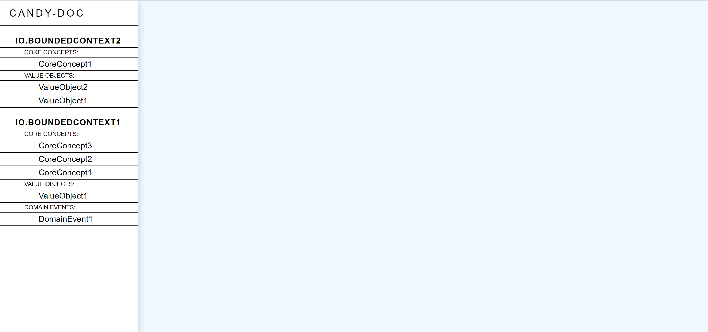
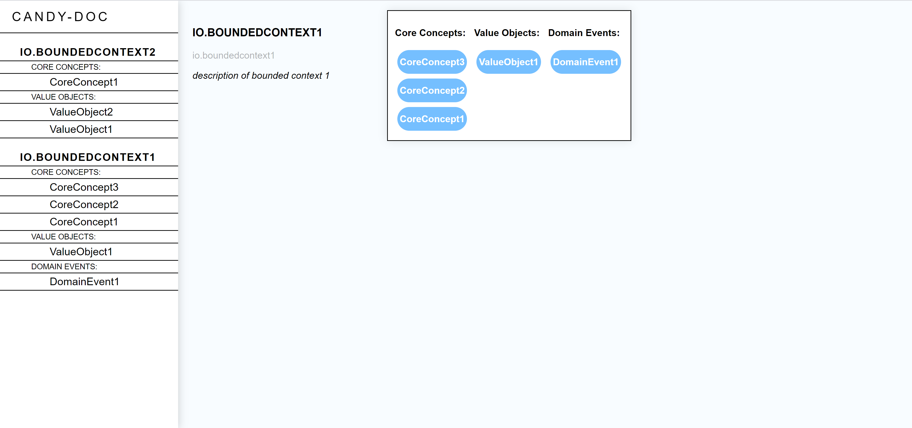
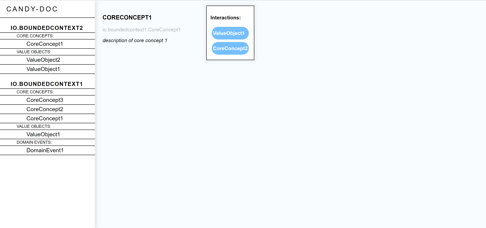
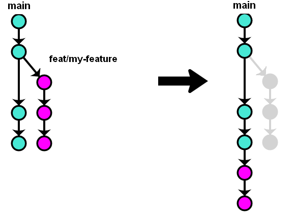

# 🍬 Candy Doc
<!-- ALL-CONTRIBUTORS-BADGE:START - Do not remove or modify this section -->
[](#contributors-)
<!-- ALL-CONTRIBUTORS-BADGE:END -->


Candy-Doc is a documentation generator plugin for projects built with the
Domain-Driven-Design approach.

> _"Domain-Driven Design is an approach to software development that centers
> the development on programming
> a domain model that has a rich understanding
> of the processes and rules of a domain."_ - Martin Fowler
> [See more](#References)

<!-- START doctoc generated TOC please keep comment here to allow auto update -->
<!-- DON'T EDIT THIS SECTION, INSTEAD RE-RUN doctoc TO UPDATE -->
## Table of Contents

- [Installation](#installation)
  - [With Maven](#with-maven)
- [🍧 DDD Annotations](#-ddd-annotations)
  - [Aggregate](#aggregate)
  - [Bounded Context](#bounded-context)
  - [Core Concept](#core-concept)
  - [Domain Command](#domain-command)
  - [Domain Event](#domain-event)
  - [Value Object](#value-object)
- [🌐 HTML Documentation](#-html-documentation)
- [🗺️ ROADMAP](#-roadmap)
- [&#91;FOR DEVELOPERS ONLY&#93; Development workflow](#for-developers-only-development-workflow)
  - [Release policy](#release-policy)
- [Technologies](#technologies)
- [References](#references)
- [Join us 🙋](#join-us-)
- [Contributors ✨](#contributors-)

<!-- END doctoc generated TOC please keep comment here to allow auto update -->

## Installation

### With Maven

To run this plugin, import the following:

```xml

<dependency>
  <groupId>io.candy-doc</groupId>
  <artifactId>candy-doc</artifactId>
  <version>${candy-doc.version}</version>
</dependency>

<plugin>
<groupId>io.candy-doc</groupId>
<artifactId>candy-doc</artifactId>
<version>${candy-doc.version}</version>
<executions>
  <execution>
    <goals>
      <goal>candy-doc</goal>
    </goals>
  </execution>
</executions>
<configuration>
  <packagesToScan>
    <packageToScan>com.foo.bar</packageToScan>
  </packagesToScan>
  <outputFormat>html</outputFormat>
</configuration>
</plugin>
```

Then, specify the configuration parameters:

**packagesToScan:** The chosen packages to scan to generate a documentation for.

Example:

```xml

<packagesToScan>
  <packageToScan>com.foo.bar.baz</packageToScan>
  <packageToScan>com.foo.qux</packageToScan>
</packagesToScan>
```

**outputFormat:** The output format in which the documentation is generated.
Output format can be either `html`, `yml`
or `json`.

Once your project is correctly annotated with
the [DDD Annotations](#DDD_Annotations), use mvn to run the plugin (
replace `${candy-doc.version}` with the current version you are using):

`mvn io.candy-doc:candy-doc:${candy-doc.version}:candy-doc`

The documentation will be generated in the `target/candy-doc` directory.

## 🍧 DDD Annotations

Domain-Driven-Design concepts are identified with annotations.

### Aggregate

```java
@Aggregate(name = "", description = "")
```

Cluster of domain objects that can be treated as a single unit. It has an
identity and a lifetime.

An aggregate contains the domain logic and is aware of framework issues.

It is accessed by commands, returns events and deals with value objects.

Value objects in an aggregate are usually seen as Domain entities. This is the
only domain model that can be mutable.

### Bounded Context

```java
@BoundedContext(name = "", description = "")
```

Set of elements (classes, services, etc) containing only what is needed in a
specific context.

Only `package-info.java` files can be annotated with `@BoundedContext`. Every
other concepts must be inside a bounded context.

### Core Concept

```java
@CoreConcept(name = "", description = "")
```

Concept with the highest level of importance inside a bounded context. It is
used in the domain layer, on aggregates and value objects.

A Core Concept can interact with other concepts.

### Domain Command

```java
@DomainCommand(description = "")
```

A command is the entry point to perform a business logic from an aggregate.

It should use primitives only (and could use value objects) and is performed on
an aggregate.

### Domain Event

```java
@DomainEvent(description = "")
```

Captures the memory of something interesting which affects the domain. It
usually starts with a verb in the past tense.

An event should always stay dumb and only carry static information.

Moreover, domain events cannot use strong domain concepts as domain logic should
never be used outside the domain.

### Value Object

```java
@ValueObject(description = "")
```

An object that has no identity, no lifetime and who is compared based on his
values.

A Core Concept can interact with one or more value objects. A Value Object only
has primitive fields, is immutable and should be valid when instantiated.

## 🌐 HTML Documentation

If you have chosen `html` as output format, you can open the generated
_index.html_ file from your file explorer to have access to the documentation.

Navigate between the concepts of your project thanks to the left-side menu



Access the content of each concept



See the interactions between concepts



## 🗺️ ROADMAP

To know on what the team are actually working on, you can see the different milestones [here](https://github.com/Candy-Doc/candy-doc-maven-plugin/milestones)

## [FOR DEVELOPERS ONLY] Development workflow

### Release policy

The development team works on a branch named _main_.

Whenever a feature needs to be implemented, a new branch must be pulled from
_main_ and merged to this latter once the feature is ready.

Every time a new version is about to be released, a merge from your new branch to _main_
will create a new tag and a new package in the package registry.



Explanations:

> Before each new feature, run:
>
> ```bash
> git checkout main
> git pull
> ```
>
> Create a new branch feat/\<branch name\> for the feature
>
> ```bash
> git checkout -b feat/\<branch name\>
> ```
>
> Once the feature is implemented, create a pull request to get the approval of a reviewer. If it's approved, your feature will be squash and merge _feat/\<branch name\>_ to _main_.
>
>See contributing rules [here](./CONTRIBUTING.md).
>
> /!\ Don't forget to pull the updated pom.xml once the release job is done. /!\
>
> ```bash
> git pull
> ```

## Technologies

Project created with:

| Technology        | Version  |
| ----------------- | -------- |
| Java              | 11       |
| Maven             | 3.6.3    |
| Reflections8      | 0.11.5   |
| Lombok            | 1.8.12   |
| Jackson           | 2.8.6    |
| Apache Freemarker | 2.3.31   |
| Apache Commons-IO | 2.8.0    |
| Maven Release     | 3.0.0-M4 |

## References

- DDD, en vrai pour le développeur (Cyrille Martraire):
  <https://www.youtube.com/watch?v=h3DLKrvp5V8>
- DDD (Martin Fowler):
  <https://martinfowler.com/tags/domain%20driven%20design.html>
- Summary of a 4 days DDD Training (Thomas Ferro):
  <https://thomasferro.medium.com/summary-of-a-four-days-ddd-training-74103a6d99a1>

## Join us 🙋

If you want to get in touch with our community there is a [Discord server](https://discord.gg/CxwdeKjtcT), join us !


## Contributors ✨

- [Contribute to the project](./CONTRIBUTING.md)

Thanks goes to these wonderful people ([emoji key](https://allcontributors.org/docs/en/emoji-key)):

<!-- ALL-CONTRIBUTORS-LIST:START - Do not remove or modify this section -->
<!-- prettier-ignore-start -->
<!-- markdownlint-disable -->
<table>
  <tr>
    <td align="center"><a href="https://github.com/mderoullers"><br /><sub><b>Maxime Deroullers</b></sub></a><br /><a href="https://github.com/Candy-Doc/candy-doc-maven-plugin/pulls?q=is%3Apr+reviewed-by%3Amderoullers" title="Reviewed Pull Requests">👀</a></td>
    <td align="center"><a href="https://ctacquet.com"><br /><sub><b>Charles Tacquet</b></sub></a><br /><a href="https://github.com/Candy-Doc/candy-doc-maven-plugin/commits?author=ctacquet" title="Documentation">📖</a></td>
    <td align="center"><a href="https://github.com/ecattez"><br /><sub><b>Edouard CATTEZ</b></sub></a><br /><a href="https://github.com/Candy-Doc/candy-doc-maven-plugin/pulls?q=is%3Apr+reviewed-by%3Aecattez" title="Reviewed Pull Requests">👀</a></td>
    <td align="center"><a href="https://github.com/Tifloz"><br /><sub><b>Tiflo</b></sub></a><br /><a href="#infra-Tifloz" title="Infrastructure (Hosting, Build-Tools, etc)">🚇</a> <a href="https://github.com/Candy-Doc/candy-doc-maven-plugin/commits?author=Tifloz" title="Documentation">📖</a> <a href="https://github.com/Candy-Doc/candy-doc-maven-plugin/pulls?q=is%3Apr+reviewed-by%3ATifloz" title="Reviewed Pull Requests">👀</a></td>
    <td align="center"><a href="https://maji.kiwi"><br /><sub><b>Maji</b></sub></a><br /><a href="https://github.com/Candy-Doc/candy-doc-maven-plugin/commits?author=M4gie" title="Documentation">📖</a></td>
    <td align="center"><a href="https://github.com/Michiels96"><br /><sub><b>Pierre</b></sub></a><br /><a href="https://github.com/Candy-Doc/candy-doc-maven-plugin/commits?author=Michiels96" title="Documentation">📖</a> <a href="#infra-Michiels96" title="Infrastructure (Hosting, Build-Tools, etc)">🚇</a></td>
    <td align="center"><a href="http://www.francois-delbrayelle.fr"><br /><sub><b>François Delbrayelle</b></sub></a><br /><a href="https://github.com/Candy-Doc/candy-doc-maven-plugin/commits?author=fdelbrayelle" title="Documentation">📖</a></td>
  </tr>
</table>

<!-- markdownlint-restore -->
<!-- prettier-ignore-end -->

<!-- ALL-CONTRIBUTORS-LIST:END -->

This project follows the [all-contributors](https://github.com/all-contributors/all-contributors) specification. Contributions of any kind welcome!

[Contributing to the project]: CONTRIBUTING.md
